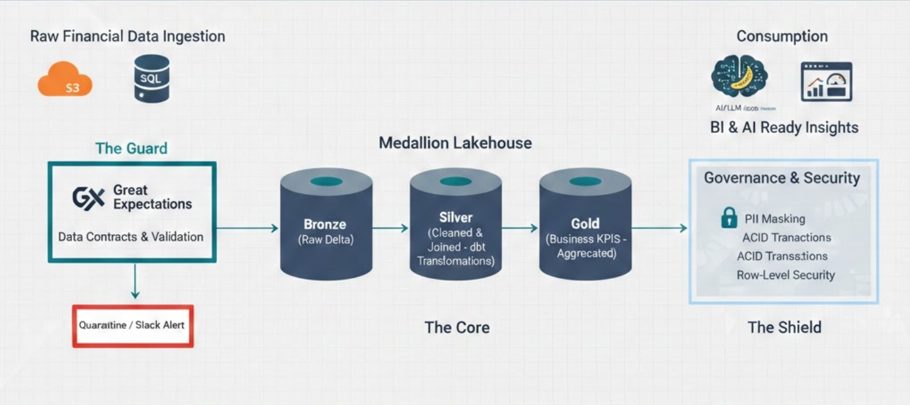
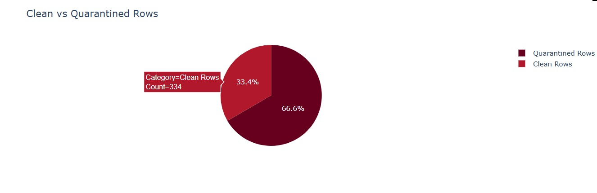
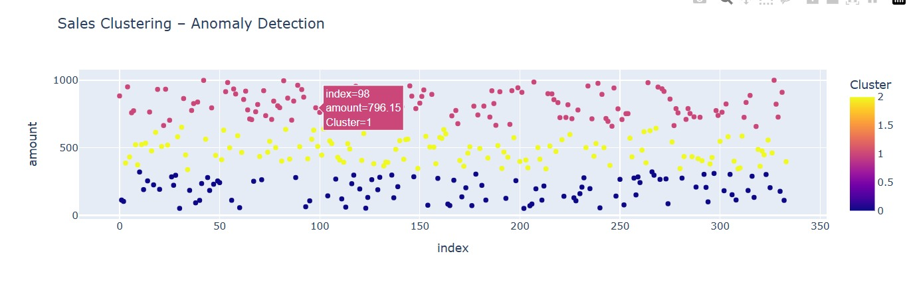
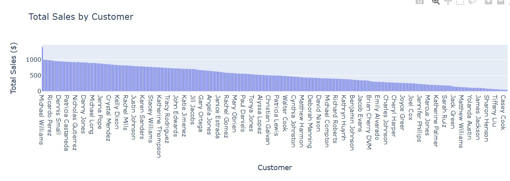

# DataTrust 360: Enterprise Financial DataOps & Observability Platform

 

> **"Turning raw financial chaos into audit-ready, AI-enabled insights."**

## 🎯 Executive Summary
In the modern financial landscape, data pipelines fail not because of code, but because of a lack of **trust**. **DataTrust 360** is a production-grade Data Engineering platform built on the **Medallion Architecture**. It focuses on **Data Observability**, **Governance**, and **Cost Optimization**, ensuring that every byte of data is validated before it hits the executive dashboard.

---

## 🏗️ The Architecture (The 5 Pillars)

### 1. Ingestion Layer (Metadata-Driven)
* **Logic:** Generic PySpark loaders driven by `config.json` to handle hundreds of tables dynamically.
* **Storage:** Immutable **Delta Lake** storage ensuring ACID transactions.

### 2. Validation Layer (The Guard)
* **Tool:** Integrated **Great Expectations (GX)** suites.
* **Action:** Automated Data Contracts checking for Schema drift, null values, and financial logic (e.g., negative amounts).
* **Observability:** Automated **Quarantine** logic with real-time **Slack Alerts**.

### 3. Transformation Layer (dbt Medallion)
* **Bronze:** Raw landing zone.
* **Silver:** Cleaned, joined, and PII-masked data.
* **Gold:** Highly aggregated Business Marts (Revenue Trends, Profit Analysis, Variance Reports).

### 4. Governance & Security (The Shield)
* **Privacy:** Automated **PII Masking** on sensitive financial fields.
* **Auditability:** Leverages Delta Lake **Time-Travel** for historical data auditing.

### 5. AI & BI Ready Layer
* **Semantic Modeling:** Standardized business metrics ready for PowerBI or **LLM (AI Chatbot)** consumption.

---

## 🛠️ The Tech Stack
* **Engine:** Apache Spark (PySpark) & Databricks
* **Warehouse:** Delta Lake
* **Transformations:** dbt Core
* **Data Quality:** Great Expectations (GX)
* **CI/CD:** GitHub Actions
* **Infrastructure:** Terraform (IaC)
* **Monitoring:** Slack API & Databricks SQL

---

## 📈 Business Value Delivered (Why this matters)
* **Zero Garbage Data:** Automated contracts ensure only 100% accurate data reaches the Gold layer.
* **Cost Efficiency:** Implements `Z-ORDER` and `VACUUM` logic to reduce cloud storage and compute costs by up to 30%.
* **Speed to Insight:** Scalable metadata-driven design allows adding new data sources in minutes, not days.
* **AI Readiness:** Clean, governed data structure designed specifically for RAG-based AI applications.

---

## 🚀 How to Run this Project
1. Clone the repository.
2. Setup your Databricks cluster.
3. Configure `configs/pipeline_config.json`.
4. Run the CI/CD pipeline via GitHub Actions.

---
**Looking for a scalable data solution?** I help companies build reliable, auditable, and cost-effective data platforms. 
[Connect with me on LinkedIn](www.linkedin.com/in/muhammadfathah) | [Visit my Portfolio](https://github.com/mohdfathah12)

##  Bronze Layer – Raw Ingestion

Reads raw CSV data and stores it as immutable Parquet files.

```python
from pyspark.sql import SparkSession

spark = SparkSession.builder.appName("BronzeLayer").getOrCreate()

df = spark.read.option("header", True) \
    .csv("/opt/data/data/raw/client_sales_raw.csv")

df.write.mode("overwrite") \
    .parquet("/opt/data/bronze/sales_transactions")

spark.stop()
```

---

##  Silver Layer – Data Cleaning & Validation

* Casts data types
* Filters invalid records
* Quarantines bad data

```python
from pyspark.sql import SparkSession
from pyspark.sql.functions import col

spark = SparkSession.builder.appName("SilverLayer").getOrCreate()

df = spark.read.parquet("/opt/data/bronze/sales_transactions")

clean_df = df \
    .withColumn("amount", col("amount").cast("double")) \
    .filter(col("amount") > 0)

clean_df.write.mode("overwrite") \
    .parquet("/opt/data/silver/sales_clean")

(df.subtract(clean_df)) \
    .write.mode("overwrite") \
    .parquet("/opt/data/silver/sales_quarantine")

spark.stop()
```

---

##  Gold Layer – Business Aggregations

Creates KPI-ready datasets.

```python
from pyspark.sql import SparkSession
from pyspark.sql.functions import sum

spark = SparkSession.builder.appName("GoldLayer").getOrCreate()

df = spark.read.parquet("/opt/data/silver/sales_clean")

gold_df = df.groupBy("status") \
    .agg(sum("amount").alias("total_sales"))

gold_df.write.mode("overwrite") \
    .parquet("/opt/data/gold/sales_summary")

spark.stop()
```

---

##  Semantic Layer

Provides business-friendly metrics.

```python
from pyspark.sql import SparkSession

spark = SparkSession.builder.appName("SemanticLayer").getOrCreate()

df = spark.read.parquet("/opt/data/gold/sales_summary")

df.write.mode("overwrite") \
    .parquet("/opt/data/semantic/business_metrics")

spark.stop()
```

---

##  Observability Layer

Tracks pipeline health and row counts.

```python
from pyspark.sql import SparkSession
from datetime import datetime

spark = SparkSession.builder.appName("Observability").getOrCreate()

metrics = [(1000, True, datetime.now())]

df = spark.createDataFrame(metrics, ["row_count", "success", "timestamp"])

df.write.mode("append") \
    .parquet("/opt/data/observability/pipeline_metrics")

spark.stop()
```

---

##  AI / ML – Anomaly Detection

Uses Spark MLlib to detect unusual sales behavior.

```python
from pyspark.ml.feature import VectorAssembler
from pyspark.ml.clustering import KMeans
from pyspark.sql.functions import col

assembler = VectorAssembler(inputCols=["amount"], outputCol="features")
data = assembler.transform(df)

kmeans = KMeans(k=2, seed=42)
model = kmeans.fit(data)

predictions = model.transform(data)
```

---

##  Dashboards

Interactive dashboards built using **Plotly + Jupyter**:

* Total sales over time
* Clean vs quarantined records
* Customer-level sales

Notebook: `notebooks/dashboards/sales_kpis_plotly.ipynb`

---

##  How to Run

```bash
docker-compose up --build
```

Open:

* JupyterLab → [http://localhost:8888](http://localhost:8888)
* Spark UI → [http://localhost:4040](http://localhost:4040) (when a job runs)

---

##  What This Project Demonstrates

* Real-world Spark pipeline design
* Medallion Architecture
* Data quality & observability
* ML integration in data platforms
* Analytics-ready outputs

---
###  Data Quality – Clean vs Quarantined Records



This visualization shows the comparison between valid (clean) records and quarantined records that failed business or data quality rules.

###  Pipeline Data Quality & Observability


Tracks row counts, pipeline success status, and overall data health across Bronze, Silver, and Gold layers.

###  ML-Based Sales Clustering



KMeans clustering applied on sales amounts to identify anomalies and unusual transaction patterns.

###  Total Sales by Customer



Highlights high-value customers and customer-level revenue contribution.

###  Total Sales by Transaction Status


Summarizes business performance based on transaction status (e.g., completed, pending, failed).


##  Author

**Muhammed Fathah**
Data Engineer | Apache Spark | Docker | Big Data

---

 If you find this project useful, give it a star!
